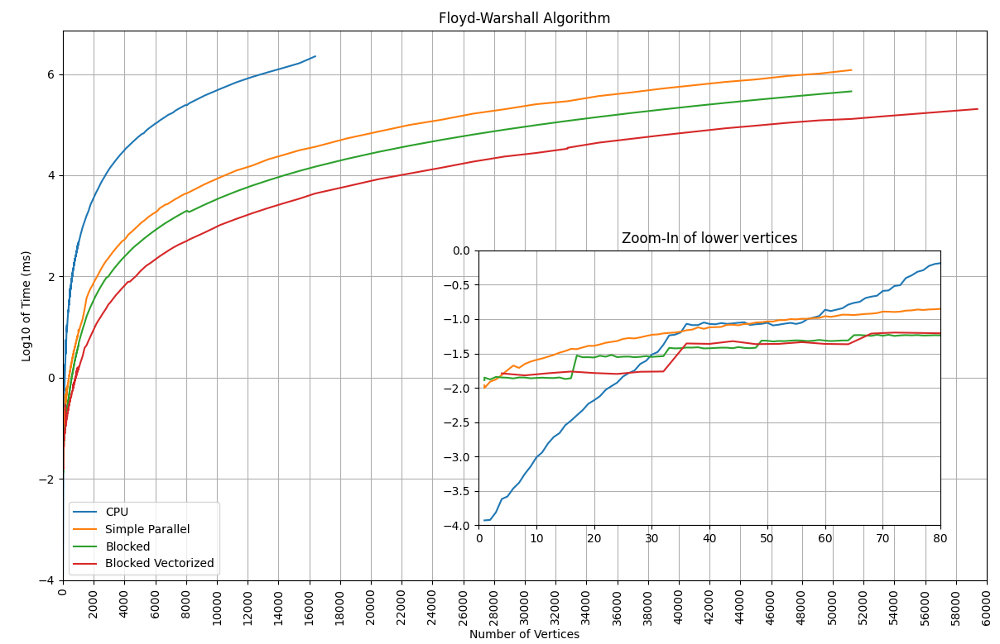

# Parallel Floyd Warshall Algorithm

## Description
Questo progetto implementa una soluzione parallelizzata dell'algoritmo di Floyd-Warshall utilizzando la tecnologia CUDA per l'esecuzione su GPU. L'algoritmo di Floyd-Warshall è ampiamente utilizzato per trovare il percorso più breve tra tutti i nodi in un grafo pesato, ed è di particolare interesse nell'ambito dei problemi di routing e di ottimizzazione di reti.

Le soluzioni proposte consistono in due approcci:
1. Parallelizzazione semplice del ciclo più esterno dell'algoritmo e una sua versione vettorizzata con tipo *short4*.
2. Versione ottimizzata dell'implementazione precedente [1] tramite l'utilizzo di sottoblocchi per aumentare la responsabilità del singolo thread e ridurre il numero di accessi alla memoria globale.
3. Blocked Floyd-Warshall: versione ottimizzata dell'algoritmo di Floyd-Warshall che sfrutta la tecnica di blocking per ridurre il numero di accessi alla memoria globale e sfruttare al meglio la cache della GPU (shared memory). Si implementa inoltre una versione vettorizzata con tipo *short4*.

Tutti i risultati sono stati testati su grafi random generati on-the-fly tramite algoritmo di Erdos-Renyi.

## Screenshots

## License
This project is licensed under the [GNU General Public License v3.0](LICENSE)

